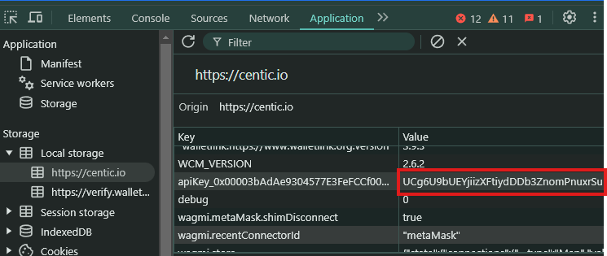

# Centic Auto Claim Tasks


This script automates claim tasks to earn the Centic Points (CTP)

## Features

- **Auto Claim Quest**
- **Auto Claim Daily Reward**
- **Support multiple accounts**
- **Support Proxy usage**

## Prerequisites

- Node.js installed on your machine
- `tokens.txt` file containing token apikey from centic platform follow instruction below to get:
- Open centic platform [https://centic.io/quests/](https://centic.io/quests/daily?refferalCode=eJwFwQERACAIA8BKgIirI9uRwfj-20t2e4ZrnLMqxHIIOLYLFsJVn6Z9_ucLwA==)
- Login With your wallet
- inspect or just F12, and find Application
- in local storage find `apiKey_` and copy all value.


## Installation

1. Clone the repository:
    ```sh
    git clone https://github.com/airdropinsiders/Centic-Auto-Claim.git
    cd Centic-Auto-Claim
    ```

2. Install the required dependencies:
    ```sh
    npm install
    ```
3. Input your centic apikey in `tokens.txt` file, one user per line;
    ```sh
    nano tokens.txt
    ```
4. optionally you can use proxy: 
- paste proxy in `proxy.txt` format `http://username:password@ip:port` 
    ```sh
    nano proxy.txt
    ```
5. Run the script:
    ```sh
    npm run start
    ```

## 

This project is licensed under the [MIT License](LICENSE).
Source : https://github.com/Zlkcyber
